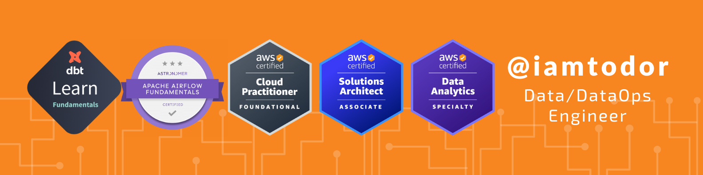

## 🤓 I am:

- Ukrainian 🇺🇦, living in Poland 🇵🇱
- Data / DataOps Engineer
- 5 years of commercial experience in IT: `Android Developer => Data Scientist => ML Engineer => Data / DataOps Engineer`
- Certifications:
  - 3x AWS Certified:
    - [AWS Certified Solutions Architect – Associate](https://www.credly.com/badges/741400de-d94d-4c49-baee-7c32df7ce755/public_url)
    - [AWS Certified Data Analytics – Specialty](https://www.credly.com/badges/e4f8ad03-aaaa-493d-956d-8406dc1711c4/public_url)
    - [AWS Certified Cloud Practitioner](https://www.credly.com/badges/4a6e053d-ce11-4e36-9c42-689feb584ded/public_url)
  - 2x Airflow Certified:
    - [Astronomer Certification for Apache Airflow Fundamentals](https://www.credly.com/badges/4ef80ab8-53ee-4486-8482-21b876cfcf3a/public_url)
    - [Astronomer Certification DAG Authoring for Apache Airflow](https://www.credly.com/badges/4ef80ab8-53ee-4486-8482-21b876cfcf3a/public_url)
  - [dbt Fundamentals](https://www.credential.net/fe4a3288-a48b-4b97-9368-ed65641d3f5a#gs.kflk9n)

## 🔧 Data/DataOps Engineer Technical Stack:

- Python | Java | Scala
- AWS: DynamoDB, DMS, EC2, CloudWatch, S3, IAM, SFPT, Lambda, EMR, Lake Formation, Glue, Athena, Kinesis Data Firehose, Amazon ElasticSearch, CDK/CloudFormation (IAC), Code Commit, Code Pipeline, Code Build, ECS, ECR
- GCP | Databricks
- Airflow
- Docker
- Jenkins | GitHub Actions
- dbt
- Spark
- Prometheus + Grafana
- SQL
- ElasticSearch
- Kafka
- Redis, MongoDB: fundamentals

## ⚡ Tech Talks, presentations and blogs:

- Ingestion and historization in the Data Lake in AWS at [HRS Group](https://www.hrs.com/):
    - 🇺🇸 [Youtube recording](https://www.youtube.com/watch?v=tZfN-8G0Yi0)
    - 🇷🇺 [Youtube recording](https://www.youtube.com/watch?v=rNBDgCM6s3I)
    - 📘 [Slides](https://www.slideshare.net/iamtodor/ingestion-and-historization-in-the-data-lake)
- Data Catalog. Inner talk at [HRS Group](https://www.hrs.com/). 📘 [Slides](https://www.slideshare.net/iamtodor/data-catalog)
- Kafka Overview. Inner talk at [Robota.ua](https://robota.ua/). 📘 [Slides](https://www.slideshare.net/iamtodor/kafka-overview-249770668)
- Configuring Python linting to be part of CI/CD using GitHub actions at [PyData #10, Krakow](https://www.meetup.com/pydata-krakow/events/288138380/). 📘  [Slides](https://www.slideshare.net/iamtodor/configuring-python-linting-to-be-part-of-cicd-using-github-actions)

## 💻 From time to time I also do:

- write 📒 blog posts:
    - 🇺🇸 [medium.com/iamtodor](https://iamtodor.medium.com/)
    - 🇺🇸 [dev.to/iamtodor](https://dev.to/iamtodor)
    - 🇷🇺 [habr.com/iamtodor](https://habr.com/ru/users/iamtodor/posts/)
- answer on ❓ [stackoverflow.com/iamtodor](https://stackoverflow.com/users/5151861/iamtodor?tab=profile)

## 📫 How to reach me:

- 👽 [linkedin.com/iamtodor](https://www.linkedin.com/in/iamtodor/)
- 📪 todor.ilya@gmail.com

<!--
iamtodor/iamtodor-- is a ✨ _special_ ✨ repository because its `README.md` (this file) appears on your GitHub profile.

Here are some ideas to get you started:

- 🔭 I’m currently working on ...
- 🌱 I’m currently learning ...
- 👯 I’m looking to collaborate on ...
- 🤔 I’m looking for help with ...
- 💬 Ask me about ...
- 📫 How to reach me: ...
- 😄 Pronouns: ...
- ⚡ Fun fact: ...
-->
